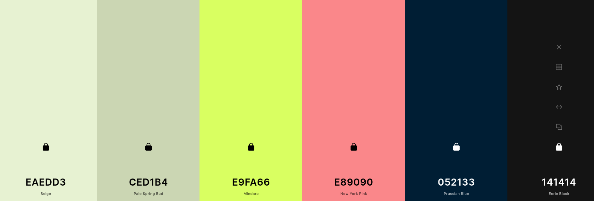

# Shaurya Showcase

#### Shaurya Personal Portfolio to showcase shaurya and his work at one place from various places.

[](https://github.com/jugshaurya/showcase)
[](https://github.com/jugshaurya/showcase)
[](https://github.com/jugshaurya/showcase)

### Colors Palette: [choose](https://coolors.co/)





### TypeScale: [choose](https://type-scale.com/)

- Font Family: Gloria Hallelujah && Roboto Mono


- Icons: [choose](https://thenounproject.com/)

## CSS:

- Options:

  - ❌ css - using sass actually
  - ❌ module-css
  - ❌ emotion - later
  - ✅ sass
  - ✅ styled-component
  - ✅ classnames - A simple JavaScript utility for conditionally joining classNames together.

- Using a combination of sass and styled component along with classnames.

* <!-- AUTO-GENERATED-CONTENT:START (STARTER) -->
<p align="center">
  <a href="https://www.gatsbyjs.org">
    
  </a>
</p>
<h1 align="center">
  Gatsby's default starter
</h1>

1.  **Start developing.**

    Navigate into your new site’s directory and start it up.

    ```shell
    gatsby develop
    ```

    Your site is now running at `http://localhost:8000`!
    `http://localhost:8000/___graphql`

## 💫 Deploy

[](https://app.netlify.com/start/deploy?repository=https://github.com/gatsbyjs/gatsby-starter-default)

[](https://vercel.com/import/project?template=https://github.com/gatsbyjs/gatsby-starter-default)

<!-- AUTO-GENERATED-CONTENT:END -->

## App Info

### Author

Shaurya Singhal
[jugshaurya](https://shaurya.now.sh)

### Version

1.0.0

### License

This project is licensed under the 0BSD License
