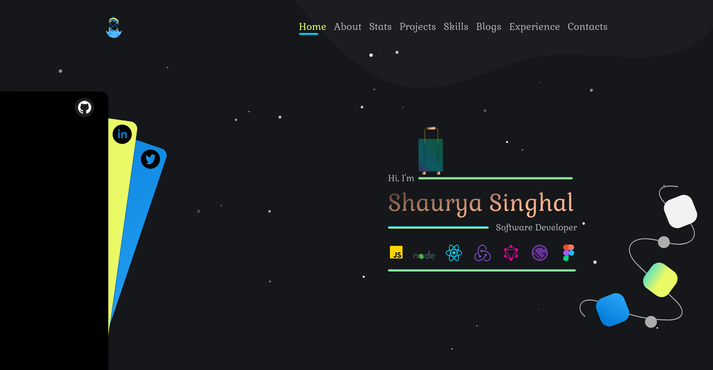
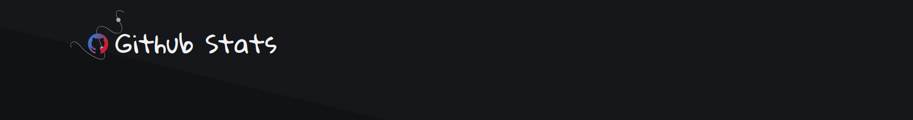
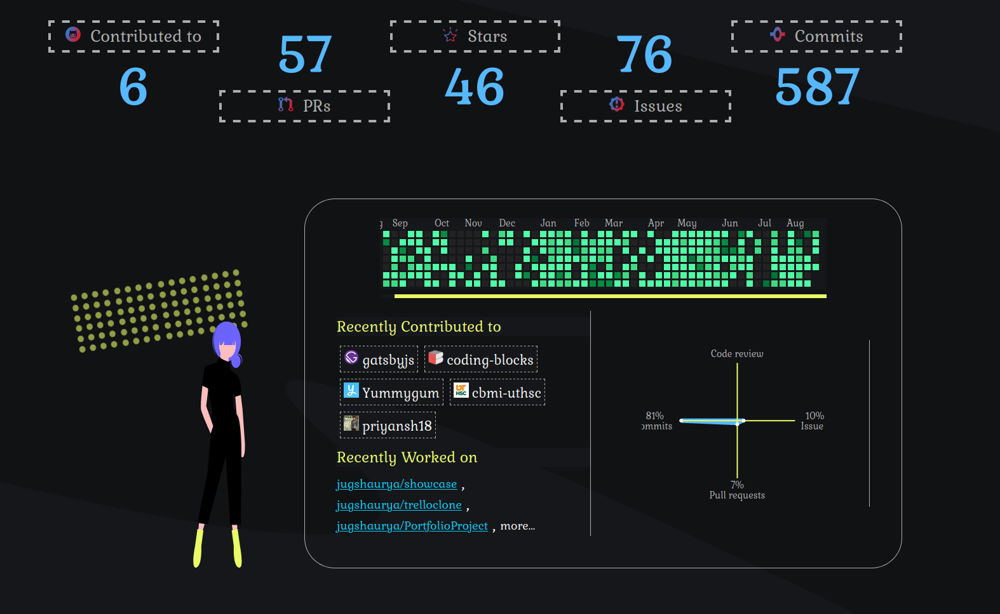

<p align="center">
  <a href="/develop-site-link">
    
    <h2 align="center">Shaurya Singhal</h2>
  </a>
</p> 
<p align="center">Shaurya Showcase | Portfolio</p>
<p align="center">Software Developer + Open Source Contributor</p>

<br>
<br>

[](https://github.com/jugshaurya/showcase)
[](https://github.com/jugshaurya/showcase)
[](https://github.com/jugshaurya/showcase)
<br/>
     

### 👀 Peek a Boo!

_🦄 Shaurya Personal Portfolio to showcase shaurya and his work at one place from various other places like from Github Repos(Jupyter Notebooks & mdx files) and medium. 🦄_






### 🌈 CSS:

- Options:

  - ❌ css - using sass actually
  - ❌ css modules - my favorite but trying styled-component this time.
  - ❌ emotion - leaving it 4 next time
  - ✔ sass
  - ✔ styled-component
  - ✔ classnames - A simple JavaScript utility for conditionally joining classNames together.
  - ✔ Framer Motion
  - ✔ AOS

- **Choice**: Using a combination of sass and styled component along with classnames.
- Font Family: Gloria Hallelujah && Roboto Mono

- Tech Used
  - Gatsby
  - React
  - Styled-components
  - Sass

### ✨ Features:

- [x] Adding _Machine Learning_ Repo as Blogs : Issue #1

  - [x] Render jupyter notebook with their respective pages.

- [x] Adding _Learn Python_ Repo as Blogs: Issue #2

  - [x] Render jupyter notebook with their respective pages.

- [x] Adding Medium Blogs as well: Issue #3
- [x] Using _Figma_ to Build the site: Issue #26
- [x] Rendering _Github Activity Svgs_ : Issue #28
- [x] Snow Effect
- [x] Bulb on/off @skills section
- [ ] Add more blogs via mdx setup or using Docasaurus: Issue #59
- [ ] Render blogs available in mdx-blogs diretory@root : Issue #59 part 2

### 👥 Contribution Guides

If you want to contribute to this repo follow the below steps:

_1. Fork and Clone the repo_

- Fork using the fork button above on this page only.
- and then clone using

```cmd
  $ git clone https://github.com/jugshaurya/showcase.git
```

_2. Run the site Locally after step 1_

- _2a. Install Dependendies_
  ```cmd
    $ yarn or npm install
  ```
- _2b. Start the gatsby server in development mode_
  ```cmd
    $ yarn develop or npm run develop
  ```

_3. Make changes/make PR_

- _3a. create a new branch_

  ```cmd
    $ git checkout -b <new-branch-anme>
  ```

- _3b. make changes and commit them_

  ```cmd
    $ git add -A
    $ git commit -m "some message and fixes#IssueNo. "
  ```

- _3c. push to origin_
  ```cmd
  $ git push origin master
  ```
- _3d. make a PR to upstream_
  ```cmd
    use GUI for doing so @github.com only
  ```
- _3e. wait for it getting merged and talk to me in the chat._

Note:- _Problem Solution_

- Sometimes port in use warning comes up:
- Solve it using
  ```cmd
    $ yarn portclean
  ```

### 🎮 Run Project

```cmd
$ yarn develop or gatsby develop or yarn dev
```

### 🚀 Deployment

```cmd
  Go to Netlify
  add project via github
  and deploy
```

### Resources

### App Info

#### Author

Shaurya Singhal
@[jugshaurya](https://shaurya.now.sh)

#### Version

1.0.0

#### License

This project is licensed under the 0BSD License.
