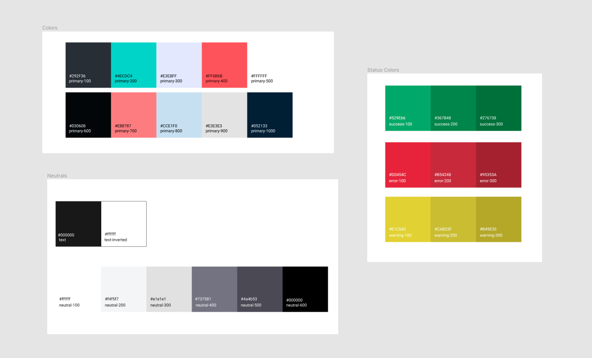
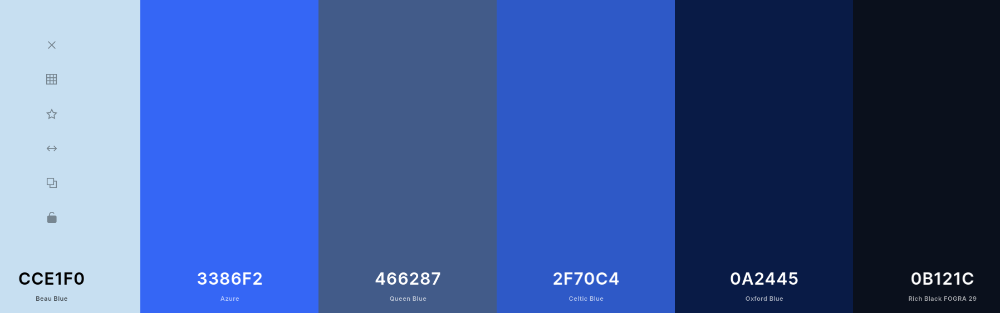
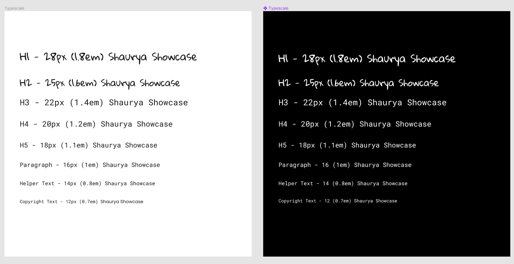
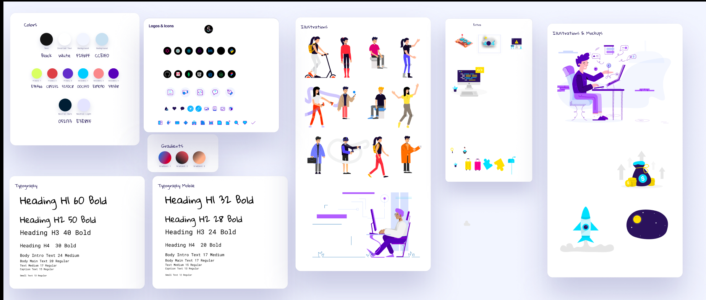

# Shaurya Showcase

#### Shaurya Personal Portfolio to showcase shaurya and his work at one place from various places.

### Colors Palette: [choose](https://coolors.co/)

### TypeScale: [choose](https://type-scale.com/)

Font Family: Gloria Hallelujah && Roboto Mono
 

### Icons: [choose](https://thenounproject.com/)
## Figma

### CSS:

- Options:

  - ❌ css - using sass actually
  - ❌ module-css
  - ❌ emotion - later
  - ✅ sass
  - ✅ styled-component
  - ✅ classnames - A simple JavaScript utility for conditionally joining classNames together.

- Choice: Using a combination of sass and styled component along with classnames.

### Features:

- [x] Adding Machine Learning Repo as Blogs : Issue #1

  - [x] Render jupyter notebook with their respective pages.

- [x] Adding Learn Python Repo as Blogs: Issue #2
  - [x] Render jupyter notebook with their respective pages.

### Run Project

- yarn develop or gatsby develop or yarn dev

### Resources

### App Info

#### Author

Shaurya Singhal
[jugshaurya](https://shaurya.now.sh)

#### Version

1.0.0

#### License

This project is licensed under the 0BSD License
